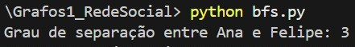
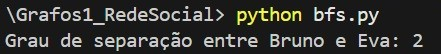

# Rede Social

**Número da Lista**: 1 
**Conteúdo da Disciplina**: Grafos 1 

## Alunos
|Matrícula | Aluno |
| -- | -- |
| 22/1029249  |  Júlia Takaki Neves |
| 22/2006392  |  Renan Batista Gonçalves Pariz |

## Sobre 
Para explorar os conceitos abordados na disciplina de Grafos 1, a dupla escolheu desenvolver uma aplicação prática simulando uma rede social de amizades, onde os relacionamentos entre usuários são representados por um grafo não direcionado.

O projeto foi dividido de forma a equilibrar o trabalho entre os integrantes, cada um responsável por implementar e testar partes específicas da lógica de grafos, como busca em largura (BFS), busca em profundidade (DFS) e detecção de componentes conexos.

Aplicações de BFS (Busca em Largura)
O BFS é ótimo para descobrir o caminho mais curto em termos de número de conexões (não em peso) entre duas pessoas.
Exemplo prático: Graus de separação
Objetivo: Dizer quantos graus de separação existem entre a pessoa A e B.
É feito um BFS a partir de A até encontrar B, contando quantos níveis você percorreu.
Pode servir pra implementar algo como: “Você e João têm 3 amigos em comum!” ou “Você está a 2 conexões de Maria”.

BFS(grafo, origem, destino):
- Retorna o grau de separação entre duas pessoas.
- Também pode retornar o caminho entre elas.

Aplicações de DFS (Busca em Profundidade)
O DFS é útil para descobrir estruturas mais "fechadas" dentro da rede, como ciclos ou componentes conectados.
Exemplo prático: Detectar grupos fechados de amigos (ciclos).
Objetivo: Encontrar "panelinhas", ou seja, ciclos no grafo.
O DFS pode identificar ciclos e componentes fortemente conectados, que representam grupos onde todos se conhecem.

DFS(grafo):
- Detecta ciclos (grupos fechados)
- Identifica componentes conectados (grupos independentes na rede)

## Screenshots
Funcionamento do BFS:

  
  

Funcionamento do DFS:

## Instalação 
**Linguagem**: Python (qualquer versão a partir da versão partir da 3.6.) 

## Uso 
Após garantir a instalação do Python, para rodar o código de BFS basta estar na pasta do projeto e digitar `python bfs.py` no terminal. De maneira análoga, para rodar o código de BFS basta estar na página do projeto e digitar `python dfs.py`.