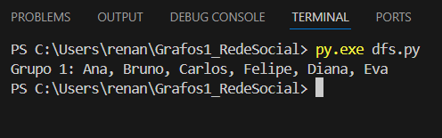

# Algortimos Gulosos

**Número da Lista**: 3 
**Conteúdo da Disciplina**: Grafos 3 

## Alunos
|Matrícula | Aluno |
| -- | -- |
| 22/1029249  |  Júlia Takaki Neves |
| 22/2006392  |  Renan Batista Gonçalves Pariz |

## Sobre 
# Projeto de Aplicação: Organização de Grades Horárias com Interval Scheduling e Interval Partitioning

Para explorar os conceitos abordados na disciplina de **Grafos 1**, a dupla escolheu desenvolver uma aplicação prática simulando o processo de montagem de **grades horárias para professores**, onde os horários de aulas são representados como **intervalos de tempo**. O objetivo é organizar essas aulas de forma eficiente, minimizando conflitos e otimizando o uso de salas ou horários disponíveis.

O projeto foi dividido de forma a equilibrar o trabalho entre os integrantes, com cada um responsável por implementar e testar partes específicas da lógica de **algoritmos gulosos**, como o **Interval Scheduling** (agendamento ótimo de aulas) e o **Interval Partitioning** (particionamento de aulas em diferentes faixas horárias ou salas).

---

## Aplicações de Interval Scheduling (Agendamento de Intervalos)

O **Interval Scheduling** é ideal para selecionar o maior número possível de aulas que **não se sobrepõem**, considerando apenas uma sala ou professor por vez.

### Exemplo prático: Maximizar número de aulas atribuídas a um professor

- **Objetivo:** Escolher o maior subconjunto de aulas que podem ser atribuídas a um único professor, sem sobreposição de horários.
- O algoritmo seleciona as aulas com os **menores horários de término primeiro**, garantindo o melhor uso do tempo disponível.

### Função: `IntervalScheduling(aulas)`
- Retorna o **maior número de aulas não conflitantes** para um professor.
- Pode ser utilizado, por exemplo, para montar a agenda pessoal de um docente ou alocar turmas em um único laboratório.

---

## Aplicações de Interval Partitioning (Particionamento de Intervalos)

O **Interval Partitioning** é útil quando **todas as aulas precisam ser alocadas**, mas há conflitos de horário. Nesse caso, busca-se o menor número de salas (ou professores) necessário para acomodar todos os intervalos sem sobreposição.

### Exemplo prático: Distribuir aulas em salas disponíveis

- **Objetivo:** Atribuir todas as aulas a horários e salas sem conflitos, utilizando o **menor número possível de recursos**.
- O algoritmo ordena os intervalos pelos horários de início e aloca cada aula à **primeira sala disponível que não tenha conflito**.

### Função: `IntervalPartitioning(aulas)`
- Retorna o **número mínimo de salas (ou professores)** necessário para realizar todas as aulas sem sobreposição.
- Pode ser usado para montar a **grade completa de uma escola ou universidade** de forma eficiente.

---

Este projeto permite visualizar, de forma prática, como **algoritmos gulosos** podem ser aplicados para resolver problemas reais de organização e logística, promovendo **eficiência no uso de recursos** como salas, horários e pessoal docente.

### Vídeo da Apresentação:
Aqui está disponível o [vídeo]   da apresentação do projeto.

## Screenshots
Funcionamento do Interval Schedule:

  
  

Funcionamento do Interval Partitioning:

  

## Instalação 
**Linguagem**: Python (qualquer versão a partir da versão partir da 3.6.) 

## Uso 
Após garantir a instalação do Python, para rodar o código de Interval Scheduling: basta estar na pasta do projeto e digitar `python scheduling.py` no terminal.  
De maneira análoga, para rodar o código de Interval Partitioning: basta estar na página do projeto e digitar `python partitioning.py`.